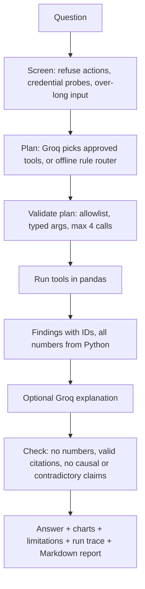

<div align="center">

# 🧪 purchase_intelligence

### A clearer view of chemical purchasing spend

Turn purchase and supplier quote files into understandable spend, supplier, and savings insights.

</div>

---

## 👋 What is this?

**purchase_intelligence** is a simple dashboard for a chemicals company. It helps category leaders, finance teams, and executives answer questions such as:

- How much did we spend on materials and freight?
- Is spend going up or down compared with recent quarters?
- Which categories and suppliers account for the most spend?
- Where might we be able to negotiate a better material price or freight rate?
- Are there unusual or incomplete data points that need checking?

The dashboard uses plain procurement language and Indian rupee values. No AI experience is needed to use it.

## 🚀 Start using the dashboard

### First time setup

Open a terminal in this project folder and run:

```bash
python -m venv .venv
```

Activate the environment:

- **Linux or macOS:** `source .venv/bin/activate`
- **Windows PowerShell:** `.venv\Scripts\Activate.ps1`

Install the required packages and start the dashboard:

```bash
python -m pip install -r requirements.txt
streamlit run app.py
```

Open the local address shown in the terminal (usually `http://localhost:8501`).

### Choose a reporting quarter

Use **Reporting quarter** near the top of the page. The main spend measures, supplier view, category view, and savings opportunities update to that quarter.

- The **spend bars** compare the selected quarter with up to two earlier quarters, when available.
- The **landed-cost line chart** keeps the full history and highlights the selected quarter in orange.

### Use your own files

At the bottom of the dashboard, open **Upload different data (optional)** and provide both CSV files. Uploading only one file means the other input continues to use the sample data; the dashboard will show a reminder. Clear both uploads to return to the sample. Each file is limited to 10 MB. Rows excluded from spend metrics are listed with the reason under **Data checks and potential anomalies**.

## 📊 What each tab shows

### Spend overview

A high-level picture of the selected quarter: landed spend, change from the prior quarter, average delivered cost per kg, and the freight share of spend. Charts show the recent spend comparison, the longer-term cost trend, category spend, and analysis checks.

### Vendor summary

A supplier scorecard focused on questions for procurement and finance leaders:

- How many suppliers were active?
- How much of spend is with the largest supplier and the top three suppliers?
- Which suppliers account for the most landed spend?
- Which suppliers have the largest indicative savings opportunities?

The horizontal bars are ranked so suppliers can be compared without interpreting bubble sizes.

### Savings opportunities

Shows three separate views of possible savings:

- **Material price:** the possible improvement if purchases matched the lowest comparable quoted material price.
- **Freight:** the possible improvement if purchases matched the lowest comparable quoted freight rate.
- **Combined landed cost:** the possible improvement if purchases matched the lowest single quote for total material price plus freight.

The tab also lists purchase lines to review and lets you download those opportunities as a CSV.

> **Important:** price-only and freight-only estimates can overlap. Do not add them together. The combined landed-cost opportunity is a separate comparison.

## 🧮 How the numbers work

For each valid purchase line:

- **Material spend** = quantity purchased × material price per kg
- **Freight spend** = quantity purchased × freight cost per kg
- **Landed spend** = material spend + freight spend
- **Average landed cost per kg** = total landed spend ÷ total quantity

Savings are compared only with offers for the **same material and source country**. This helps avoid misleading comparisons between different materials or origins.

The application calculates spend and savings with Python. The optional Groq AI service reviews quality findings and calculations and can provide a plain-English summary. Every AI-produced KPI is checked against an independent Python calculation; if it does not match, the dashboard uses the Python result instead. The AI does not get to change the underlying purchase arithmetic.

**How to describe this honestly:** the dashboard is a modular analytics workflow (deterministic Python calculations plus an optional Groq review), not an autonomous agent. Only the Ask the analyst tab lets a model choose between tools, and only from a fixed allowlist.

## 📁 The included sample data

Two reproducible CSV files are included so the dashboard can be explored without company data:

| File | What it contains |
| --- | --- |
| `data/purchase_history.csv` | Purchase lines across 10 quarters, from 2024 Q1 through 2026 Q2. Includes material, quantity, price, supplier, country, freight, chemical category, and family. |
| `data/vendor_offers.csv` | Vendor quotes by material and country, including quoted price per kg and freight to India per kg. |

The sample has **1,315 purchase lines** and **332 vendor offers**. Some purchase rates deliberately differ from the quote baseline so the data-quality and savings checks have examples to find. This is demonstration data, not actual company spend.

To recreate the same sample files:

```bash
python -m purchase_intelligence.data.generate_mock_data
```

The generator uses a fixed seed, so it recreates consistent sample data.

## 🧠 Optional Groq AI summary

The dashboard and all arithmetic work without a Groq key. To enable the AI review, add your key to a local `.env` file in the project folder:

```text
GROQ_API_KEY=your-key-here
```

You can optionally choose a Groq model with `GROQ_MODEL`. Keep `.env` private; never share it or commit it to source control. If Groq is unavailable, the app uses the local Python analysis and remains usable.

## ☁️ Deploy on Streamlit Community Cloud

The code is published in the GitHub repository **Purchase-Intelligence**, on the **`main`** branch. To deploy it:

1. Sign in to [Streamlit Community Cloud](https://share.streamlit.io/) with GitHub and authorize Streamlit to access this repository. If the repository is private, also grant access to private repositories in the Streamlit account's **Settings → Linked accounts → Source control**.
2. Choose **Create app**, then select `pavandeep-godi/Purchase-Intelligence`, branch `main`, and the app file `app.py`.
3. If you want Groq AI on the hosted app, open the app's **Settings → Secrets** and add:

	```toml
	GROQ_API_KEY = "your-key-here"
	```

	Do not put the key in a GitHub file. The hosted app reads Streamlit Secrets; the local app can read the ignored `.env` file. The app can be deployed without a key, using Python analysis and local summaries.

If Streamlit says it cannot find or connect to the repository, first check that you selected the `main` branch and `app.py`, and that Streamlit has GitHub permission to access the repository. Repository admins can authorize the GitHub connection.

## � Ask the analyst (bounded tool workflow)

The **Ask the analyst** tab answers a narrow set of procurement questions: top savings opportunities (by material, supplier or category), why landed spend changed, best quotes for a material, data-quality issues, and supplier views. It is deliberately **not** a general chatbot.



| Step | Who decides | Notes |
| --- | --- | --- |
| Refuse purchase actions and credential probes | Python rules | Runs before any Groq call, so it costs no tokens |
| Choose tools and arguments | Groq, validated by Python (offline rules as fallback) | Six tools: `profile_data`, `check_data_quality`, `compare_spend`, `explain_variance`, `rank_savings_opportunities`, `lookup_best_quote` |
| Every number | Python (pandas) | Variance parts (volume/mix, price rates, freight rates, new/dropped materials) sum exactly to the total change |
| Explanation prose | Groq, then validated | Dropped if it contains digits, currency, causal wording, unknown citations or contradicts known data issues |

Limits: at most 4 tool calls per question, 300-character questions, 20 questions per browser session. Open **How this was answered** to see each step, its status and timing, the run ID (data fingerprint + quarter), Groq tokens used, and the shared budget.

The AI cannot run code or SQL, read files, change data, or place orders. Savings are indicative leads for human review, and the tool is not an autonomous purchasing system.

### Free-tier reality check (measured, October 2026)

| Resource | Limit | How the app stays inside it |
| --- | --- | --- |
| Groq free tier (key used in testing, model `qwen/qwen3.8-27b`) | 8,000 tokens/minute, 1,000 requests/day | A process-wide budget guard (7,200 tokens/min, 900 requests/day) skips Groq when exhausted; about 0.7-1.4k tokens per question; identical questions are cached; 429/network errors fall back to Python |
| Streamlit Community Cloud | about 2.7 GB memory, 2 CPU cores, apps sleep after 12 hours without traffic | Plain pandas on about 1.3k rows; uploads capped at 10 MB in `.streamlit/config.toml`; no database or extra services |

Your own account's limits may differ; check them at console.groq.com. Because the Groq quota is shared by all visitors of a deployed app, heavy public use will exhaust it and the app will then show deterministic answers only.

### Evaluation

`evaluation/cases.json` holds 18 questions with the expected status, tools and arguments (supported questions, ambiguity, unknown quarter, purchase actions, credential and prompt-injection attempts, off-topic, over-long input).

```bash
python run_evaluation.py --mode rules   # offline, no Groq calls
python run_evaluation.py --mode live    # real Groq planner and explanation; paced, uses about 13k tokens
```

Latest results (saved in `reports/`): **offline rules 18/18, live Groq 18/18** (Groq planned 11 of the cases; the rest were screened or clarified before planning). Caveats: the same author wrote the cases and the offline router, so the offline score shows regression safety rather than independent accuracy; 18 cases is a small sample; live results vary by model run, and one earlier live run had the model skip an optional step (cases now check the minimum sufficient tool set). Unit tests use a mocked LLM and also cover invalid or oversized plans, unsafe prose, Groq failure, budget exhaustion and key redaction.

## �📝 Create a shareable analysis report

Generate a plain-text summary and a machine-readable JSON report from the included CSVs:

```bash
python run_analysis.py
```

Reports are saved in `reports/`:

- `purchase_summary.txt` — executive summary, quality findings, KPIs, and calculation reconciliation.
- `purchase_summary.json` — the same analysis in a structured format.

## ✅ Run the checks

To confirm the project calculations and data checks are working:

```bash
python -m unittest discover -s tests -v
```

The 35 tests need no Groq key or network. They cover the spend and savings arithmetic, tool argument validation, variance reconciliation to row-level totals, the orchestrator with a mocked LLM, guardrails, and the token budget.

## ⚠️ Use savings as leads, not promises

A lower quote does not automatically mean a supplier can provide the same quality, quantity, delivery schedule, or commercial terms. The estimates do not include supplier qualification, capacity, taxes or duties, foreign exchange, lead time, contract terms, or switching costs. Procurement, operations, and finance should verify each opportunity before taking action.
